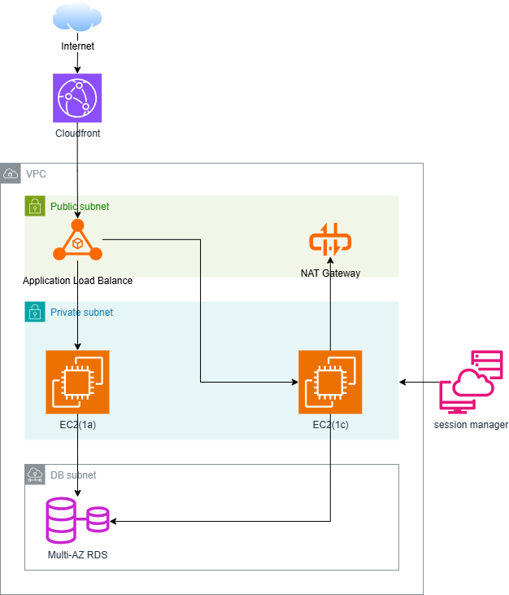

# AWS 3層Webインフラ構成 ポートフォリオ

## 概要

オンプレミス環境を想定した3層Webシステムを、TerraformでAWS上に構築したポートフォリオです。  
可用性・セキュリティ・運用性を意識したインフラ設計を実装しています。

---

## 構成図



---

## 使用技術

| カテゴリ | 技術・サービス |
|---|---|
| IaC | Terraform |
| ネットワーク | AWS VPC / Subnet / Route Table / Internet Gateway / NAT Gateway |
| 配信・負荷分散 | Amazon CloudFront / ALB (Multi-AZ) |
| コンピューティング | Amazon EC2 (Multi-AZ) |
| データベース | Amazon RDS MySQL (Multi-AZ) |
| セキュリティ | AWS IAM / Security Group / AWS SSM Parameter Store |
| 運用・監視 | AWS Systems Manager Session Manager / Amazon CloudWatch |

---

## インフラ構成の詳細

### ネットワーク設計

VPCを3層のサブネットに分割し、各層の役割を明確に分離しています。

| サブネット | CIDR | 配置リソース |
|---|---|---|
| Public Subnet | 10.0.1.0/24 (1a) / 10.0.2.0/24 (1c) | ALB / NAT Gateway |
| Private Subnet | 10.0.11.0/24 (1a) / 10.0.12.0/24 (1c) | EC2 |
| DB Subnet | 10.0.21.0/24 (1a) / 10.0.22.0/24 (1c) | RDS |

### セキュリティ設計

セキュリティグループで、必要な通信のみを許可しています。

```
Internet
  ↓ 80番ポートのみ許可
ALB Security Group
  ↓ ALB SGからの通信のみ許可
EC2 Security Group
  ↓ EC2 SGからの通信のみ許可
RDS Security Group
```

EC2へのログインはSSH（キーペア）を使用せず、**SSM Session Manager**を採用しています。  
これによりポート22を完全にクローズし、よりセキュアな運用を実現しています。

### 可用性設計

| リソース | 設計 | 目的 |
|---|---|---|
| ALB | Multi-AZ | 単一AZ障害時の継続稼働 |
| EC2 | 2AZ構成 (1a / 1c) | 単一AZ障害時の継続稼働 |
| RDS | Multi-AZ (1a Primary / 1c Standby) | 障害時の自動フェイルオーバー |
| NAT Gateway | Public Subnetに配置 | Privateサブネットからの安全なアウトバウンド通信 |

### DBパスワード管理

RDSのマスターパスワードはコードにベタ書きせず、**AWS Systems Manager Parameter Store（SecureString）** で管理しています。  
TerraformのSensitive変数と組み合わせることで、`terraform plan`の出力にもパスワードが表示されない設計にしています。

---

## 設計方針

### 可用性
単一障害点（SPOF）を排除するため、主要リソースをすべてMulti-AZ構成にしています。  
RDSはMulti-AZによる自動フェイルオーバーに対応しており、プライマリ障害時も短時間でスタンバイに切り替わります。
CloudFrontを利用し静的コンテンツのキャッシュによるレスポンス向上を実現

### セキュリティ
- EC2・RDSはPrivate/DBサブネットに配置し、インターネットから直接到達できない構成
- セキュリティグループの連鎖参照により、各層間の通信を最小権限で制御
- SSM Session Managerによりポート22（SSH）を完全クローズ
- DBパスワードをParameter Store（SecureString）で暗号化管理

### IaC（Infrastructure as Code）
全構成をTerraformでコード化しています。  
手作業によるミスを排除し、環境の再現性と変更管理を担保しています。

---

## 改善余地（本番環境を想定した場合）

現在のポートフォリオ構成から、本番導入時に追加すべき要素を整理しています。

| 項目 | 内容 |
|---|---|
| Auto Scaling |Auto Scaling Groupを使用し、CPU使用率等のメトリクスに応じて自動でスケールアウト・インできる構成にする
| HTTPS化 | ACM（AWS Certificate Manager）で証明書を取得しALBに適用、443ポートに変更 |
| WAF導入 | AWS WAFをCloudFrontまたはALBに適用し、SQLインジェクション・XSS等を防御 |
| CloudTrail | API操作ログを取得し、セキュリティインシデント時の証跡を確保 |
| AWS Config | リソース設定変更の記録・コンプライアンスチェックを自動化 |
| NAT Gateway冗長化 | コストとのトレードオフを考慮し学習環境では1台構成 |
| RDSバックアップ設定 | 自動バックアップ保持期間の設定とスナップショット運用ルールの整備 |

---

設計検討およびレビュー補助として生成AIを活用。
提案内容についてはAWS公式ドキュメントを参照し、
妥当性を検証した上で採用した。

- **インフラ経験**：5年（Linux / ネットワーク設計構築 / Windows Server / 仮想化 / 監視・障害対応）
- **AWS資格**：AWS SAA / AWS SAP 取得済
